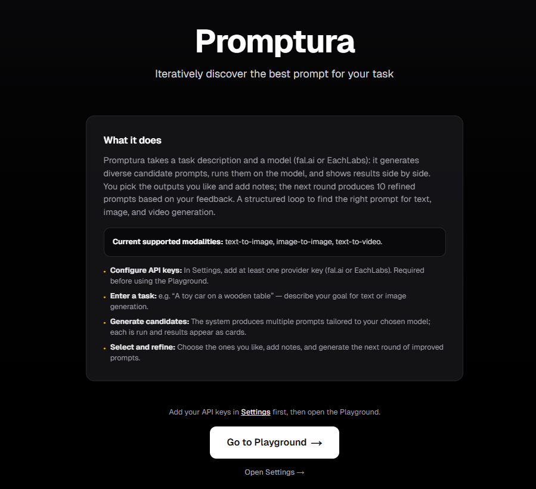
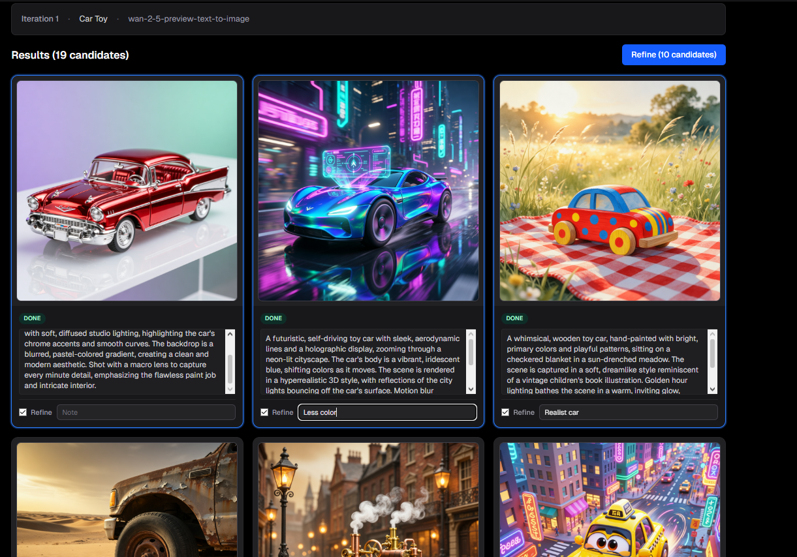

# Promptura

Promptura is an iterative prompt optimization playground for multimodal generation models.

Instead of writing one prompt and hoping it works, you define a task, generate multiple candidate prompts, compare outputs, select what worked, add feedback, and refine the next generation.

**Live demo:** https://promptura.osmanyigitsokel.com

## Preview





## Why this exists

Prompting multimodal generation models is usually trial-and-error.

Small prompt changes, model changes, and provider-specific behavior can produce very different outputs. Without an iteration loop, it becomes hard to understand what worked, what failed, and how to improve the next attempt.

Promptura explores prompt creation as an optimization workflow: generate candidates, evaluate real outputs, keep what worked, and refine with feedback.

## How it works

1. **Define task** — describe the outcome you want instead of writing a raw prompt.
2. **Generate candidates** — Gemini creates multiple prompts using the selected model spec.
3. **Run outputs** — execution providers such as fal.ai or EachLabs run the candidate prompts.
4. **Select and annotate** — choose outputs that worked and add notes.
5. **Refine** — Gemini uses selected prompts, notes, and output summaries to produce the next generation.

Task → Generate → Run → Select → Refine → Repeat

## What it does

- Generates multiple candidate prompts from a task goal
- Runs prompts against supported generation providers
- Tracks iterations, runs, statuses, and outputs
- Lets users select successful outputs and add feedback
- Refines future prompts using selected results and notes
- Supports provider-agnostic execution through an adapter layer
- Stores model specs and iteration history in PostgreSQL

## Engineering notes

- Promptura treats prompting as an iterative optimization loop, not a one-off text input.
- Gemini is responsible for prompt authoring; execution providers only run prompts.
- Model metadata is normalized into a provider-independent ModelSpec.
- Runtime execution is provider-agnostic through an ExecutionProvider abstraction.
- User provider keys are encrypted at rest and only decrypted in memory when needed.
- The project separates prompt authoring, model research, execution, iteration state, and admin workflows.

## Architecture

```txt
Task goal
  ↓
Gemini prompt generation
  ↓
Candidate prompts
  ↓
ExecutionProvider abstraction
  ↓
fal.ai / EachLabs model runs
  ↓
Run outputs + status polling
  ↓
User selection + notes
  ↓
Gemini refinement
  ↓
Next iteration
```

For design rationale and implementation detail, see [docs/architecture.md](docs/architecture.md) and the architecture decisions below.

## System capabilities

- Google OAuth with NextAuth v5
- User/provider key management with AES-256-GCM encryption
- Admin model catalog
- Gemini-based model research and ModelSpec generation
- fal.ai and EachLabs execution providers
- Iteration status polling
- PostgreSQL-backed users, model endpoints, iterations, and runs

## Current scope

- Current workflow: task-based prompt generation and refinement
- Current generation path: text-to-image and text-to-video focused
- Phase 1 video scope: text-to-video
- Deferred: image-to-video and video-to-video provider adapters
- Not a general chatbot or manual prompt runner

## Architecture decisions

- [ADR-004: Iteration and Refine Design](docs/adr/ADR-004-iteration-and-refine-design.md)
- [ADR-005: Gemini Key Strategy](docs/adr/ADR-005-gemini-key-centralized.md)
- [ADR-008: Param-Free ModelSpec](docs/adr/ADR-008-param-free-model-spec.md)

## Local development

```bash
git clone <repo-url>
cd promptura
cp .env.example .env.local   # fill in values
npm install
npm run dev
```

See [docs/setup.md](docs/setup.md) for auth, provider keys, and model catalog operations.
